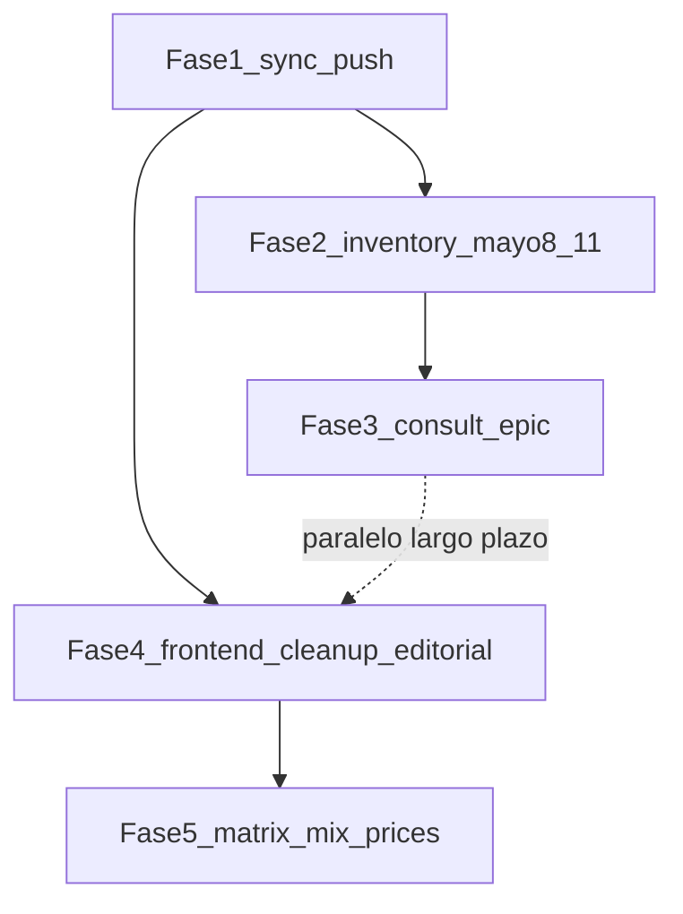

# Plan de ciclo: sincronización, consultoría automatizada y depuración UI (mayo 2026)

Documento vivo que **sustituye/amplía** el plan corto de delegación por roles. Orden de ejecución acordado con el priorizador: **primero todo subido y desplegado “jalando”; después depuración, estética y capacidades de producto.**

---

## Fase 1 — Sincronización total (prioridad máxima)

**Objetivo:** que lo que debe estar en GitHub y en demo producción (**alquimia**) esté alineado sin basura accidental.

### 1.1 Hygiene antes del push

- **Revertir** o sacar del diff cualquier cambio en [`AJUSTES.ALQUIMIA/archivos_ejecutados/mayo_2026_semana_1_8/`](AJUSTES.ALQUIMIA/archivos_ejecutados/mayo_2026_semana_1_8/) que no sea entrega deliberada (texto archivado no debe mutar con el código).
- Excluir del commit: `listado de observaciones.docx`, lock `~$...`, binarios de Word salvo decisión explícita.
- Agrupar el trabajo real en commits temáticos (backend Ágora/dossier vs frontend simulador vs docs), luego `git push origin main` (o rama acordada + PR).

### 1.2 Verificación despliegue

- Seguir checklist de [`RELEASE_OPS_2026-05.md`](../RELEASE_OPS_2026-05.md): `APP_ENV`, `NEXT_PUBLIC_API_URL`, `/health`, `/health/deep`, `robots.txt`, cabeceras `X-Request-ID` según lo implementado en backend.
- Confirmar **GitHub Actions** verde en el commit desplegado.

### 1.3 Actualizar ancla operativa

- Rellenar [`COLA_Y_ROLES_AGENTES.md`](../../../COLA_Y_ROLES_AGENTES.md) (foco: “post-sync + producto consultoría + UI”) y una línea append en [`BITACORA_AUDITORIA_PLANEACION.md`](BITACORA_AUDITORIA_PLANEACION.md) con SHA desplegado.

**Rol principal:** Ejecutor + humano ops. **Auditor:** revisar que no se suban secretos ni docx ruido.

---

## Fase 2 — Inventario “8–11 mayo” (contexto del agente anterior)

**Objetivo:** localizar material creado en esa ventana (en disco o sin trackear) y decidir qué integra al producto vs archivo.

- Inventario por **fecha de modificación** en el repo (y carpetas no trackeadas que el humano indique), cruzando con:
  - trabajo activo en `backend/app/agents/` (p. ej. [`dossier.py`](../../../backend/app/agents/dossier.py)), [`moduleEditorialBriefs.ts`](../../../frontend/src/data/moduleEditorialBriefs.ts), [`ModuleEditorialBrief.tsx`](../../../frontend/src/components/simulator/ModuleEditorialBrief.tsx).
- Resultado esperado: lista breve “archivo / integrar / descartar” + PRs sugeridos.

**Rol:** Planner + Ejecutor (solo lectura y clasificación primero).

---

## Fase 3 — Visión “consultoría automatizada” (épica, no bloquea Fase 1)

**Objetivo de producto (tu definición):** ALQUIMIA como sistema que **interpreta** problemas y reglamentos, **investiga** y localiza **contexto de localidad** (web y fuentes acotadas), sin confundir simulación con acto oficial.

### 3.1 Límites (Auditor + Navigator)

- **Auditor:** todo output sigue siendo expositivo/simulación salvo integración explícita con fuentes oficiales verificadas.
- **Navigator:** cualquier “contexto territorial” nuevo (CVE, límites, capas) no puede basarse solo en scraping genérico; jerarquía de fuentes según NAVIGATOR.
- No prometer “sabe igual que un abogado” en UI sin gates legales existentes (`legal_gate`, disclaimers [`simulationDisclaimer.ts`](../../../frontend/src/lib/simulationDisclaimer.ts)).

### 3.2 Líneas técnicas (para planificar después del sync)

- **Pipeline ingestión:** reglamento/markdown/PDF ya en repo → chunking → retrieval ligero (existente reasoning/hub puede extenderse) vs RAG externo evaluación costo.
- **Herramienta web:** búsqueda acotada (dominios permitidos, citas obligatorias, log de URLs) detrás de feature flag — **Ejecutor** diseña POC; **Auditor** revisa disclaimers.

**Rol:** Planner define MVP de “consultoría” vs backlog largo; **Ejecutor** implementa POC en iteración siguiente a Fase 1.

---

## Fase 4 — Depuración y estética frontend (después del sync)

**Objetivo:** limpiar módulos, eliminar redundancias y unificar narrativa tipo **walk-me-through** en **cada sección**.

### 4.1 Patrón editorial unificado

- Tomar como referencia literaria la **entrada ciudadana inicial** del simulador (tono escaneable, filosofía implícita) y el componente existente **`ModuleEditorialBrief`** ([`frontend/src/components/simulator/ModuleEditorialBrief.tsx`](../../../frontend/src/components/simulator/ModuleEditorialBrief.tsx) + datos en [`moduleEditorialBriefs.ts`](../../../frontend/src/data/moduleEditorialBriefs.ts)).
- Extender a **todo módulo** del flujo principal:
  - **Qué hago / cómo lo hago / por qué lo hago.**
  - **Justificación** de cada cálculo visible (enlace textual a matriz de fuentes, véase Fase 5).
  - **Resumen ejecutivo por fases** donde aplique (ej.: “En fase 2 al inicio hacían falta X centros de acopio; durante el crecimiento en 3 años se esperan N empleos y …”) — debe anclarse a datos del **`municipalPlanTimeSeries`** / metas cuando existan, o marcarse como **ilustrativo** si los datos no están cerrados (**Auditor**).

### 4.2 Limpieza estructural

- Auditoría de componentes simulator: rutas muertas, duplicidad de filtros KPI, texto largo disperso (`WalkthroughArticle` landing vs simulator — alinear patrones donde tenga sentido sin duplicar mantenimiento).
- **Rol principal:** Ejecutor + Aesthete (revisión visual jerarquía, densidad por audiencia según [`cursor-rules/AESTHETE-1.md`](../../../cursor-rules/AESTHETE-1.md)).

---

## Fase 5 — Matriz de fuentes de cálculo + precios y mezcla (reemplazo sliders)

### 5.1 Fuente única de verdad (“fuentes de cálculo”)

- Localizar la carpeta o export que llamas **`fuentes de cálculo`** (en el disco actual puede no estar en Git con ese nombre; si está fuera del repo o sin trackear, definir **ruta canónica** dentro de `frontend/src/data/` o `backend/data/` y versionar JSON/TS con:
  - id de magnitud (precio, fracción, kg/cápita, etc.)
  - valor por defecto y rango
  - fuente institucional (ej. SEMARNAT, NOM, estudio municipal, mercado observado)
  - URL/nota/trace al documento cuando exista
- Esta matriz es la que deben usar **precios**, **mezcla de RSU**, y cualquier KPI que antes “flotaba” sin cita.

### 5.2 Precios en UI

- Donde hoy hay **slider de precio**: mientras existe el control, **mostrar en tiempo real la cita fuente** (tooltip o línea debajo cambiante) según ítem de matriz seleccionado.
- **Eliminar sliders de precios** donde el modelo lo permita y sustituir por **entrada explícita** (moneda/contrato/documento) manteniendo trazabilidad a la matriz (no barra ocultando el supuesto).

### 5.3 Mezcla de materiales (% que suman 100%)

- Sustituir sliders de proporción por **vectores porcentuales** que sumen **100%** sobre la generación disponible derivada del **supuesto kg per cápita** (**tú indicas punto de referencia ~0.90 kg/c/día usuario ajustable**).
- Benchmark **SEMARNAT** u oficio nacional usado como **valor inicial** (~**45%** orgánica ejemplo) con cita obligatoria en UI y en datos.
- Persistencia en **store**: validación `Σ fracciones = 100` y aviso cuando el usuario fuerza combinación incompatible con región (opcional navegador reglas).

### 5.4 Testing

- Tests de suma porcentajes y de que cada fracción mapee a entrada de matriz; snapshot de texto de cita donde aplique.

**Rol:** Ejecutor (datos + store + UI), **Navigator** sólo si mezclas se anclaran a colección territorial nueva, **Auditor** texto “no oficial” visibles.

---

## Delegación resumida por agente

| Rol | Primero (sync) | Luego |
|-----|----------------|------|
| **Planner / vos** | Aprobar commits y orden de merges; fijar MVP consultoría | Priorizar POC RAG/search vs mejoras UI |
| **Ejecutor** | Push limpio + CI | Matriz datos, composición %, briefing por módulo |
| **Auditor** | Secretos/disclaimers en PR | Todo texto “consultivo” vs oficial; gates legales |
| **Navigator** | Skip salvo cambios CVE/geo | Scraping/contexto territorial estructurado |
| **Aesthete** | Opcional typo | Jerarquía walk-through, sliders→% menos ruido |
| **Release/Ops** | RELEASE_OPS curls | Monitor post-deploy |

---

## Dependencias entre fases

**Nota:** Fase 3 puede avanzar en paralelo con Fase 4 solo si hay capacidad; no debe retrasar el sync de Fase 1.

---

*Última revisión: alineado a pedido de priorizar subida y despliegue; luego depuración, estética, artículo-narrativa por módulo, matriz de fuentes, citas en precios y mix porcentual con anclaje kg/cápita / SEMARNAT.*
