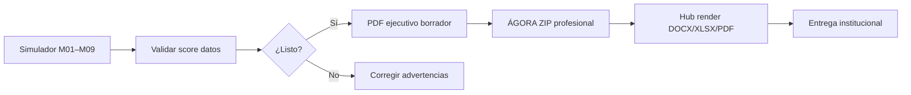

# Catálogo de entregables — consultoría ALQUIMIA

**Norma SUPREME · 22 mayo 2026**  
Fuente de verdad para qué documentos entrega la plataforma, a quién van dirigidos y por qué canal se distribuyen.

---

## Principios de entrega

| Principio | Regla |
|-----------|--------|
| Tipografía PDF | **Times New Roman** (Times-Roman en motor ReportLab) |
| Tono | Consultoría municipal de élite — portada, secciones numeradas, tablas KPI, aviso legal |
| Trazabilidad | Cada PDF incluye score de datos, fuentes y advertencias del escenario |
| Cadena de custodia | Documento legal firmado ≠ borrador algorítmico (ver S7) |
| No sustitución | Ningún PDF sustituye acto de autoridad ni dictamen certificado |

---

## Matriz de entregables (servicio sectorial RSU)

| ID | Documento | Formatos | Audiencia | Tier | Canal de generación |
|----|-----------|----------|-----------|------|---------------------|
| 01 | Resumen ejecutivo municipal | PDF, DOCX | Alcalde · Cabildo | Profesional | `POST /export/executive-pdf` · ZIP ÁGORA profesional |
| 02 | Modelo técnico-financiero | XLSX, PDF | Tesorería · Financieros | Profesional | Hub → render profesional → `05_Modelo_Financiero_CFO.xlsx` |
| 03 | Diagnóstico jurídico | DOCX, MD | Jurídico municipal | Profesional | ZIP ÁGORA base/profesional |
| 04 | Presentación cabildo | PPTX/PDF | Cabildo | Borrador | ÁGORA (pipeline document_specs 04) |
| 05 | Manual operativo 90 días | DOCX, PDF | Operaciones · Concesionario | Borrador | ZIP ÁGORA |
| 06 | Carta ciudadana | DOCX | Comunicación social | Borrador | ZIP ÁGORA |
| 07 | Matriz de trazabilidad | MD, PDF | Auditor · PMO | Borrador | ZIP ÁGORA · sección PDF ejecutivo |
| 08–11 | Anexos sectoriales | MD/DOCX | Técnico | Borrador | ZIP ÁGORA |
| — | Paquete integral | ZIP | Equipo completo | Cabildo | `fetchAgoraPlanZip` + render profesional |
| — | Acta inspección / expediente sancionatorio | PDF | Inspección municipal | Borrador técnico | `ExpedientePDF` (jsPDF) tras POST expediente |

---

## Canales en producto (UI)

### 1. Borrador PDF rápido (simulador)
- **Botón:** «Exportar borrador PDF» (barra de módulo, header, footers M03/M05)
- **API:** `POST /export/executive-pdf`
- **Entrega:** descarga directa `.pdf` Times New Roman
- **Requisito:** línea base calculada (`resultados` en store)

### 2. Paquete S20 — Exportar
- **PDF Ejecutivo** → `executive-pdf`
- **Excel CFO** → redirección `/hub` (render XLSX)
- **Compartir URL** → clipboard del escenario
- **Genera mi plan** → modal ÁGORA + Drive
- **Genera mi plan completo (ÁGORA)** → ZIP Markdown + manifest

### 3. Hub documental (`/hub`)
- ZIP base (Markdown)
- Render profesional → DOCX + XLSX + PDF
- ZIP profesional descargable

### 4. Expediente cabildo (M06)
- Previsualización secciones → `POST /export/report` (JSON)
- **Descargar PDF ejecutivo** → `executive-pdf` con secciones seleccionadas en `module_label`

### 5. Inspección predial
- **Generar PDF** → scroll a expediente generado; descarga acta vía `ExpedientePDF`

---

## Flujo recomendado para cabildo

---

## Referencias cruzadas

- `cursor-rules/INDICE_MAESTRO_ENTREGABLES.md` — **índice maestro + estructura por documento**
- `backend/app/export/document_blueprints.py` — blueprints PDF (portada + TOC + §)
- `backend/app/agents/document_specs.py` — especificaciones 01–11
- `backend/app/export/pdf_renderer.py` — layout consultoría Times New Roman
- `frontend/src/lib/consultingDeliverables.ts` — catálogo tipado frontend
- `RESPUESTA_SUPREME_A_EIDOS_2026-05-22.md` — decisiones S1–S11

SUPREME · Wave 2 cierre documental
