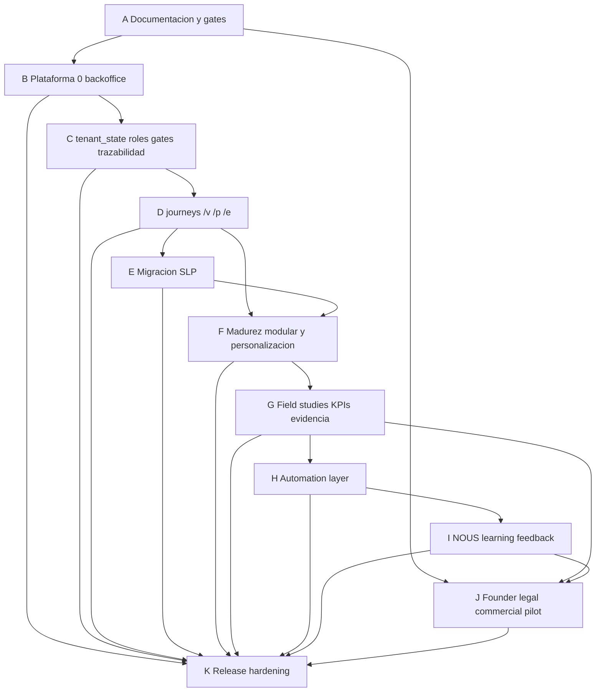

# IMPLEMENTATION DEPENDENCY GRAPH

**Uso:** mapa de dependencias para evitar activar capacidades antes de su evidencia, gate humano o base legal/metodologica.

## Grafo principal

## Dependencias criticas

| Activacion | Debe ocurrir antes | Evidencia minima | Responsable |
|---|---|---|---|
| NOUS observacional | Opt-in framework, tenant isolation, storage de corrections/outcomes/deltas. | Tests opt-in true/false y no publicacion. | NOUS/KOSMOS/AUDITOR. |
| Publicar patrones NOUS | N suficiente, bias check aprobado, founder gate, trazabilidad, opt-in valido. | Queue A11, audit log, patron aprobado, no tenants identificables. | Founder/AUDITOR. |
| Piloto real | Fase 35 readiness PASS, scope, evidence log, sponsor, responsable de datos, legal si aplica. | `PILOT_READINESS_CHECKLIST.md` completo. | Founder/cliente. |
| Contrato preliminar | Oportunidad calificada, red flags revisadas, SOW preliminar, abogado si aplica. | Paquete contractual y legal/compliance. | Founder/legal. |
| Release | Access gates, datos SLP, registry, export/provenance, visual QA, smoke backend/frontend. | Checklist release hardening. | AUDITOR/BIOS/KRONOS/POLIS. |
| Field study local | Alcance, responsable, metodologia, costo, fecha y evidencia. | Registro de estudio o brecha critica. | Municipio/tercero/founder. |
| Claims de impacto | Baseline, fuente, metodo, sensibilidad, estudio local si aplica, responsable humano. | Claim evidence matrix y evidence log. | AUDITOR/founder/legal. |
| Automatizacion documental | Document engine, standards map, provenance, review state, bloqueo de export si falta evidencia. | Caso feliz y bloqueado. | KRONOS/MARCOS/AUDITOR. |

## Dependencias por decision humana

| Decision | Quien decide | No puede decidir |
|---|---|---|
| Cerrar gate o cambiar stage | Founder/responsable humano autorizado. | NOUS, AGORA, agente, pipeline. |
| Publicar patron NOUS | Founder con AUDITOR/bias gate. | NOUS automaticamente. |
| Usar datos tenant en agregado | Cliente/founder/legal via opt-in explicito. | Sistema por default. |
| Presentar claim externo | Founder/legal/responsable institucional. | Documento generado sin revision. |
| Convertir piloto en contrato | Founder/legal/cliente. | CRM, agente o automatizacion. |

## Dependencias por evidencia externa

| Tema | Depende de | Sin evidencia |
|---|---|---|
| Caracterizacion local RSU | Estudio de cuarteo u otra evidencia local aceptada. | Brecha critica. |
| Rutas y tiempos | Estudio operativo de rutas. | No optimizar como verdad local. |
| Inclusion sector informal | Censo/estudio local. | No afirmar impacto social local. |
| CAPEX/OPEX real | Datos financieros y/o cotizaciones. | Escenario preliminar. |
| KPI internacional | Fuente, formula, standard y dato requerido. | KPI faltante, no narrativa sustituta. |
