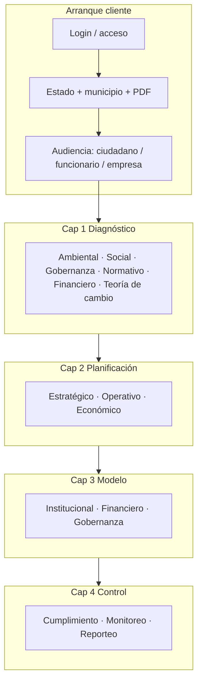

# Constitución ALQUIMIA — Capítulos, rubros y módulos

Documento de referencia sobre **cómo está armado el simulador ALQUIMIA**: la lógica pedagógica (4 capítulos), la descomposición por rubros, los `module_id` canónicos y qué ve cada audiencia.

**Fuentes de verdad en código**

| Concepto | Archivo |
|----------|---------|
| Capítulos y rubros | `frontend/src/lib/chapterConfig.ts` |
| Etiquetas y decisiones por módulo | `frontend/src/lib/simulator/clientModuleRegistry.ts` |
| Visibilidad por audiencia | `frontend/src/lib/audienceModules.ts` |
| Render UI | `frontend/src/app/simulator/renderDecisionModule.tsx` |
| Journey backend (legacy IDs) | `backend/app/city/repository.py` → `journey_for()` |
| Mockups ↔ código | `FRONTEND DEFINITIVO/MODULE_MAP.md` |

---

## 1. Arquitectura general

ALQUIMIA organiza el trabajo municipal en **cuatro capítulos** que responden a una pregunta guía cada uno. Dentro de cada capítulo hay **rubros** (ejes temáticos) y dentro de cada rubro **módulos** (`module_id`) con pantalla propia en el simulador.



### Flujo de entrada completo (producto)

```
/ (landing)
├── /gobierno         → catálogo de módulos gobierno
│   ├── /gobierno/rsu → redirect → /login → /simulator (con onboarding)
│   └── [Salud, Transporte, Educación, Urb.] → "próximamente"
├── /privados         → sector privado (landing próximamente)
└── login inline      → /login → /gobierno (cliente) o /simulator (dev)
```

| Ruta | Descripción |
|------|-------------|
| `/` | Landing — 3 opciones: Gobierno, Privados, Ya tengo cuenta |
| `/gobierno` | Catálogo de módulos municipales (RSU activo, 4 bloqueados) |
| `/gobierno/rsu` | Punto de entrada RSU → redirect a `/simulator` |
| `/privados` | Sector privado (coming soon) |
| `/login` | Login con redirect a `/gobierno` (cliente) o `/simulator` (dev) |
| `/simulator` | Simulador con gate onboarding → audiencia → módulos |

| Rol | Comportamiento |
|-----|----------------|
| **Cliente** (`rol: cliente`) | Login → `/gobierno` → elige RSU → `/gobierno/rsu` → `/simulator` → onboarding (estado + municipio + PDF) → audiencia → módulos. |
| **Equipo ALQUIMIA** (`admin`, `analista`) | Login → `/simulator` directo, sin onboarding ni catalog. |
| **Sin PDF** | No se habilita análisis jurídico ni módulos que dependen de ÁGORA (`agora_bloqueado`, `can_enable_simulation: false`). |

### Módulos gobierno planeados

| ID | Servicio | Estado | Scope previsto |
|----|----------|--------|----------------|
| `rsu` | Residuos Sólidos Urbanos | **Activo** | 4 capítulos × 34 módulos (este documento) |
| `salud` | Salud pública municipal | Próximamente | Infraestructura sanitaria, epidemiología, cobertura |
| `transporte` | Transporte público | Próximamente | Eficiencia rutas, cobertura, modelo tarifario |
| `educacion` | Educación municipal | Próximamente | Rezago educativo, infraestructura INIFED, proyección |
| `urbano` | Desarrollo urbano / zonificación | Próximamente | Uso de suelo, CENAPRED, PDUM |

Política de archivos: solo **PDFs** en `frontend/public/reglamentos/`. Los adendos los generan los agentes jurídicos; el frontend consume, no produce.

---

## 2. Los cuatro capítulos

| Cap. | Nombre | Pregunta guía | Color UI | Módulos (funcionario) |
|------|--------|---------------|----------|------------------------|
| **1** | Diagnóstico | ¿Cuál es el punto de partida real? | Verde `#3B6D11` | 14 |
| **2** | Planificación | ¿Qué necesitamos construir? | Azul `#1A5FA8` | 9 |
| **3** | Modelo | ¿Quién paga, quién opera y es viable? | Ámbar `#D4881E` | 6 |
| **4** | Control | ¿Cómo arrancamos y cómo medimos? | Púrpura `#4A1C7A` | 5 |

Además del recorrido por capítulos, el funcionario ve **M00 — Guía de circularidad** (`guia_circularidad`) como índice narrativo previo al Cap. 1.

---

## 3. Capítulo 1 — Diagnóstico

**Objetivo:** construir una foto honesta del municipio (RSU, sociedad, gobernanza, norma y costo de no actuar) antes de planear.

| Rubro | ID rubro | Módulo | Nº | Label (decisión) |
|-------|----------|--------|-----|------------------|
| Ambiental | `ambiental` | `city_baseline` | 01 | Línea base territorial y RSU |
| Ambiental | `ambiental` | `impacto_ambiental` | 01B | Impacto ambiental y sanitario |
| Social | `social` | `social_diagnostico` | 02 | Diagnóstico demográfico y vulnerabilidad |
| Social | `social` | `social_encuesta` | 02B | Encuesta de aceptación ciudadana |
| Social | `social` | `mapeo_actores` | 02C | Mapeo de actores y voluntad política |
| Gobernanza operativa | `gobernanza_operativa` | `organigrama_diagnostico` | 02D | Organigrama actual — gobierno y concesionario |
| Institucional-normativo | `institucional_normativo` | `capacidad_institucional` | 03 | Capacidad institucional del municipio |
| Institucional-normativo | `institucional_normativo` | `marco_legal` | 03B | Marco legal y brechas reglamentarias |
| Institucional-normativo | `institucional_normativo` | `cobertura_territorial` | 03C | Cobertura territorial y comparativa ZM |
| Institucional-normativo | `institucional_normativo` | `dictamen_tecnico` | 03D | Dictamen técnico de la reforma |
| Financiero-económico | `financiero_economico` | `costo_omision` | 04 | Costo de la omisión — contrafactual 10 años |
| Financiero-económico | `financiero_economico` | `evaluacion_socioeconomica` | 04B | Evaluación socioeconómica |
| Teoría de cambio | `cierre_diagnostico` | `teoria_cambio` | 04C | Teoría de cambio — cómo se conecta todo |

**Componentes clave:** `CityBaselineStack`, `ImpactoAmbientalStack`, `MunicipalContextStack` (marco legal / cobertura), `DiagnosticoJuridico`, `CostoOmisionStack`, `TeoriaCambioStack`.

**Gate jurídico:** `marco_legal` y `capacidad_institucional` dependen de PDF cargado para el municipio activo.

---

## 4. Capítulo 2 — Planificación

**Objetivo:** traducir el diagnóstico en plan maestro, infraestructura, personal, logística y costos operativos.

| Rubro | ID rubro | Módulo | Nº | Label |
|-------|----------|--------|-----|-------|
| Estratégico | `estrategico` | `plan_maestro` | 05 | Plan maestro y metas de captura |
| Estratégico | `estrategico` | `ruta_critica` | 05B | Ruta crítica PERT-RACI |
| Estratégico | `estrategico` | `oleadas_territoriales` | 05C | Oleadas territoriales de despliegue |
| Operativo | `operativo` | `infraestructura` | 06 | Infraestructura — dimensionamiento CAs |
| Operativo | `operativo` | `organigrama` | 07 | Organigrama y estructura de personal |
| Operativo | `operativo` | `logistica` | 08 | Logística, rutas y diseño de piloto |
| Operativo | `operativo` | `plan_educativo` | 08B | Plan educativo y comunicación social |
| Económico | `economico` | `costos_programa` | 09 | Costos del programa — CAPEX y OPEX |
| Económico | `economico` | `mercado_materiales` | 10 | Mercado de materiales y compradores |

**Componentes clave:** `FutureGoalsModule` (plan / PERT / oleadas), `InfrastructureOperationsStack`, `OrganigramaStack`, `LogisticaOperativaStack`, `CostosProgramaStack`, `MarketTraceabilityStack`.

**Referencia mockup:** filas M04 (infra/logística), META (`future_goals` → `plan_maestro`).

---

## 5. Capítulo 3 — Modelo

**Objetivo:** cerrar quién opera, cómo se financia y si el negocio aguanta bajo distintos escenarios.

| Rubro | ID rubro | Módulo | Nº | Label |
|-------|----------|--------|-----|-------|
| Institucional | `institucional` | `esquema_concesion` | 11 | Esquema de concesión y operador |
| Financiero | `financiero` | `arbol_financiamiento` | 12 | Árbol de financiamiento — 6 caminos |
| Financiero | `financiero` | `escenarios_financieros` | 13 | Escenarios financieros — TIR/VPN/Monte Carlo |
| Financiero | `financiero` | `riesgos_modelo` | 14 | Riesgos y sensibilidad del modelo |
| Gobernanza | `gobernanza` | `expediente_cabildo` | 15 | Expediente completo para Cabildo |

**Componentes clave:** `EsquemaConcesionStack`, `ArbolFinanciamientoStack`, `ScenariosExportStack`, `MarketTraceabilityStack` (riesgos), `ExpedienteCabildoStack`.

**Referencia mockup:** M06 (`scenarios_export`), M08 (`risk_trends` → `riesgos_modelo`).

---

## 6. Capítulo 4 — Control

**Objetivo:** operación en campo, cumplimiento, monitoreo y reporte ESG/trazabilidad.

| Rubro | ID rubro | Módulo | Nº | Label |
|-------|----------|--------|-----|-------|
| Cumplimiento | `cumplimiento` | `inspeccion` | 16 | Inspección y estrategia de enforcement |
| Monitoreo | `monitoreo` | `monitoreo_operativo` | 17 | Monitoreo — proyectado vs. real |
| Reporteo | `reporteo` | `doble_materialidad` | 18 | Doble materialidad y reporte ESG |
| Reporteo | `reporteo` | `trazabilidad` | 19 | Trazabilidad de fuentes y bibliografía |

**Componentes clave:** `InspeccionStack`, `MonitoreoRealStack`, `DobleMaterialidadStack`, `ReferenciasCalculos`.

**Referencia mockup:** INS (`inspeccion_predios` → `inspeccion`), TRACE (`source_traceability` → `trazabilidad`).

---

## 7. Audiencias y módulos visibles

No todos los usuarios ven los 34 pasos del funcionario. La matriz en `audienceModules.ts` define el subconjunto.

### Ciudadano (`citizen`) — 4 módulos

| module_id | Contenido |
|-----------|-----------|
| `city_baseline` | Línea base RSU simplificada |
| `marco_legal` | Contexto normativo / diagnóstico jurídico lite |
| `citizen_inputs` | Educación ciudadana |
| `impact_finance` | Impacto ambiental y multiplicadores (vista ciudadana) |

### Funcionario (`functionary`) — 34 módulos

`guia_circularidad` + los 33 módulos de `FUNCTIONARY_MODULE_ORDER` (Cap. 1–4 en orden de `chapterConfig.ts`).

El journey se enriquece en cliente con `buildFunctionaryJourney()` (merge backend + `CLIENT_FUNCTIONARY_MODULES`).

### Empresa / organización (`entrepreneur`, `entry=organization`) — 4 módulos

| module_id | Contenido |
|-----------|-----------|
| `organization_profile` | Declaración / perfil (`DeclaracionWizard`) |
| `containers_provider` | Placeholder logística contenedores |
| `market_traceability` | Portal empresarial |
| `organization_report` | Exportación de reporte |

Journey definido en backend `journey_for('organization')`.

---

## 8. Aliases legacy (backend ↔ frontend)

El backend histórico usa IDs distintos; el frontend los resuelve con `LEGACY_MODULE_ALIASES` en `chapterConfig.ts`:

| Legacy (API) | Canónico (UI) |
|--------------|---------------|
| `municipal_context` | `marco_legal` |
| `future_goals` | `plan_maestro` |
| `infrastructure_operations` | `infraestructura` |
| `scenarios_export` | `escenarios_financieros` |
| `risk_trends` | `riesgos_modelo` |
| `inspeccion_predios` | `inspeccion` |
| `monitoreo_real` | `monitoreo_operativo` |
| `source_traceability` | `trazabilidad` |
| `social_study` | `social_diagnostico` |
| `organigrama_programa` | `organigrama` |
| `logistica_operativa` | `logistica` |
| `market_traceability` | `mercado_materiales` (funcionario) u otro stack según audiencia |

Al implementar nuevos endpoints o agentes, preferir **IDs canónicos** de la columna derecha.

---

## 9. Capas transversales (no son capítulos)

| Capa | Descripción |
|------|-------------|
| **Store Zustand** | `simulatorStore.ts` — territorio, supuestos, resultados, audiencia, `clientSetupComplete`. |
| **ÁGORA / agentes** | Diagnóstico jurídico, validador, research — backend `app/agents/`, bloqueo si no hay PDF. |
| **Cartografía** | Mapas Google/INEGI; reglas SRID en `cursor-rules/NAVIGATOR.md`. |
| **Research intelligence** | Perplexity + persistencia — `backend/app/research/`. |
| **Estadístico** | PERT, Monte Carlo, multiplicadores IO — `backend/app/statistical/`. |
| **Proyecto vivo** | Portal municipal dinámico — `ProyectoVivoPortal`, rutas `/proyecto/[municipio_id]`. |

---

## 10. Orden recomendado de lectura (funcionario)

1. **M00** Guía de circularidad  
2. **Cap. 1** completo (01 → 04C), cerrando con teoría de cambio  
3. **Cap. 2** estrategia → operación → costos  
4. **Cap. 3** concesión → financiamiento → escenarios → riesgos → expediente  
5. **Cap. 4** inspección → monitoreo → ESG → trazabilidad  

Este orden coincide con `FUNCTIONARY_MODULE_ORDER` y con la navegación lateral del simulador (`ModuleNav` + `DecisionModuleShell`).

---

## 11. Mantenimiento del documento

Actualizar este archivo cuando:

- Se agregue o renombre un `module_id` en `chapterConfig.ts`
- Cambie la matriz de audiencias
- Se mueva un stack de componente entre módulos
- Cambie el flujo de onboarding cliente (territorio + PDF)

Última revisión: alineada con onboarding cliente (estado + municipio + PDF al login) y arquitectura de capítulos en `chapterConfig.ts`.
